This is a [Next.js](https://nextjs.org/) project bootstrapped with [`create-next-app`](https://github.com/vercel/next.js/tree/canary/packages/create-next-app).

## Getting Started

First, run the development server:

```bash
npm run dev
# or
yarn dev
# or
pnpm dev
# or
bun dev
```

Open [http://localhost:3000](http://localhost:3000) with your browser to see the result.

You can start editing the page by modifying `app/page.tsx`. The page auto-updates as you edit the file.

This project uses [`next/font`](https://nextjs.org/docs/basic-features/font-optimization) to automatically optimize and load Inter, a custom Google Font.

## Learn More

To learn more about Next.js, take a look at the following resources:

- [Next.js Documentation](https://nextjs.org/docs) - learn about Next.js features and API.
- [Learn Next.js](https://nextjs.org/learn) - an interactive Next.js tutorial.

You can check out [the Next.js GitHub repository](https://github.com/vercel/next.js/) - your feedback and contributions are welcome!

## Deploy on Vercel

The easiest way to deploy your Next.js app is to use the [Vercel Platform](https://vercel.com/new?utm_medium=default-template&filter=next.js&utm_source=create-next-app&utm_campaign=create-next-app-readme) from the creators of Next.js.

Check out our [Next.js deployment documentation](https://nextjs.org/docs/deployment) for more details.


shashank
 npx create-next-app@latest
 npm run dev

file based routing

 execution - npm run dev --layout.tsx---root layout is rendered ----children will call local host ----page will be rendered 


 React server components 
 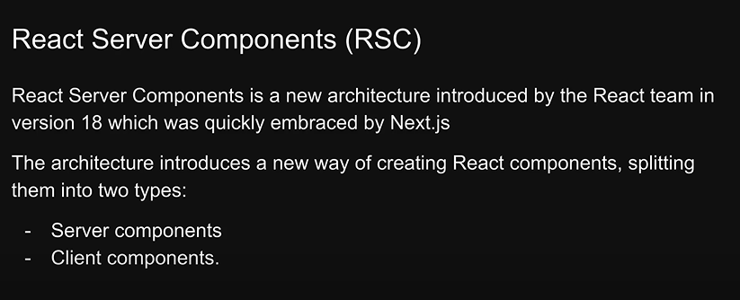
 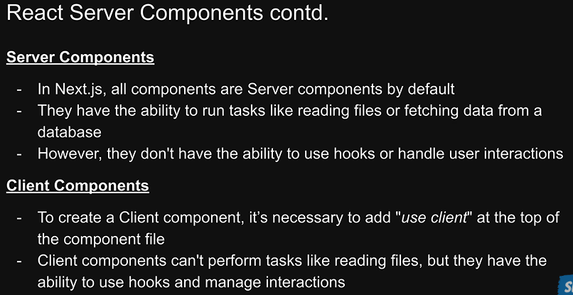

 Nested routing 
 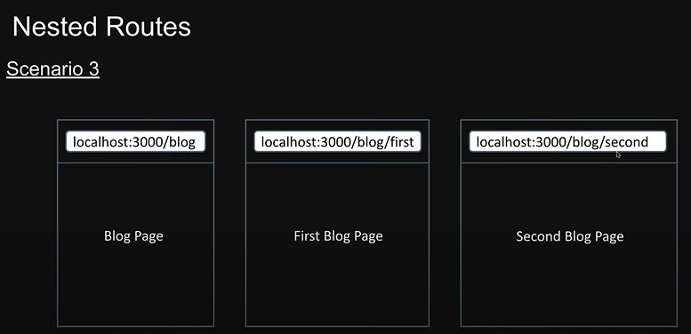
 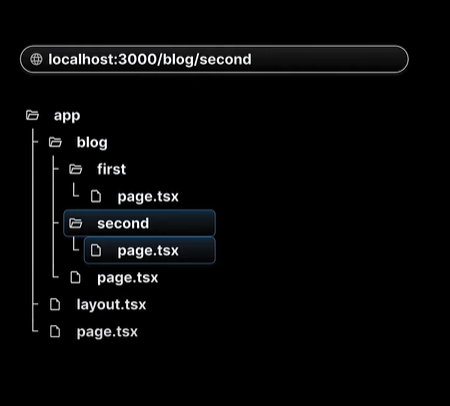

 Dynamic routing
 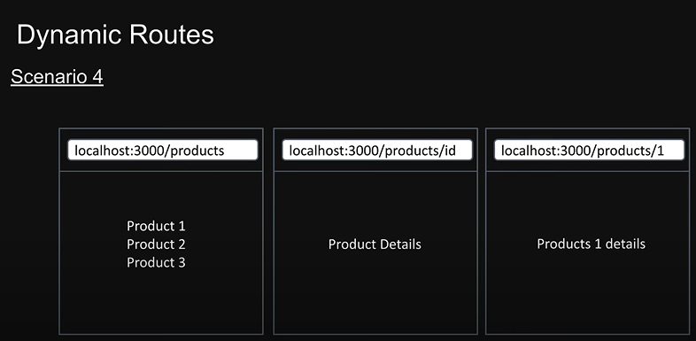
 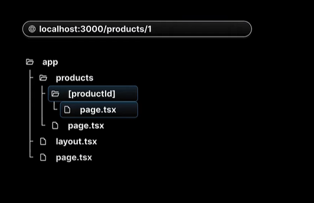

 Nested dynamic routing
 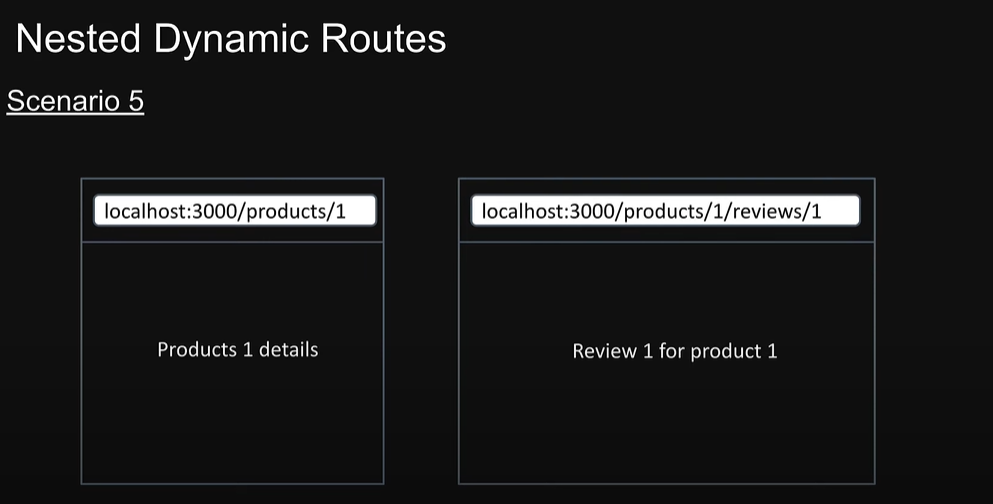
 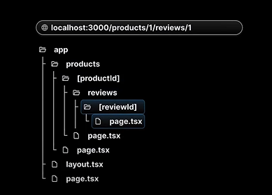


 catch all segments 
 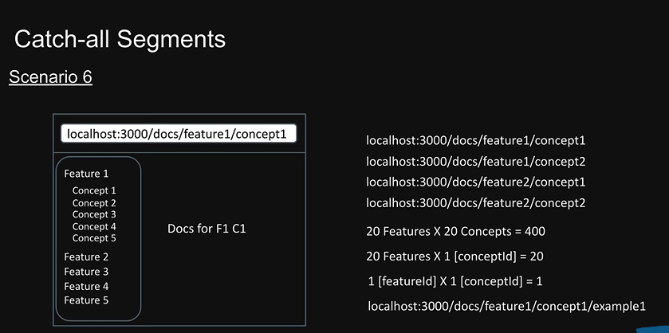
 slug is common terminology for url

 private folder 
 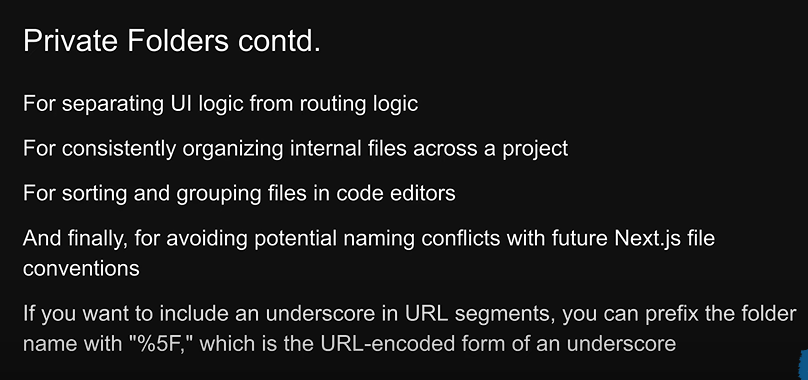

 route Groups
 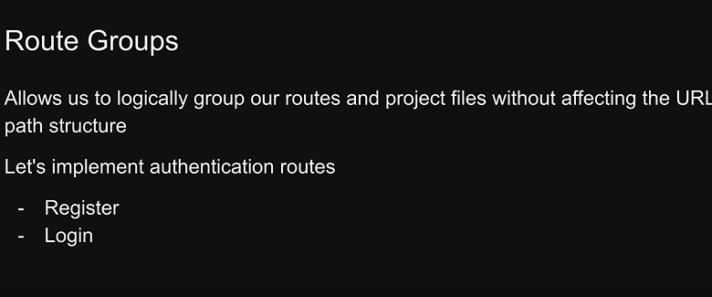

 (auth)-using ()will tell next js to vomit out the routes from url

 before -auth -register 
 http://localhost:3000/auth/register 

 after   (auth) -register 
 http://localhost:3000/register 

 Routing Metadata

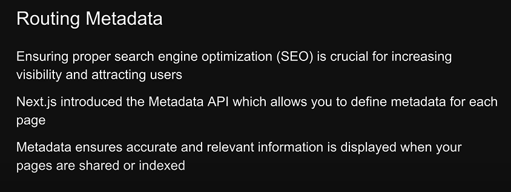

Navigation


Navigation Programmatically
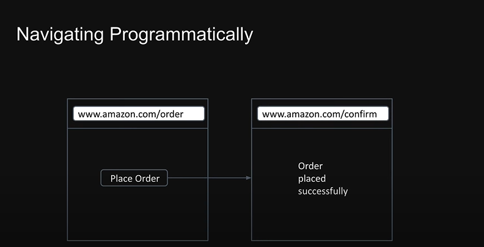
when clicked on place order we need to redirect to home page
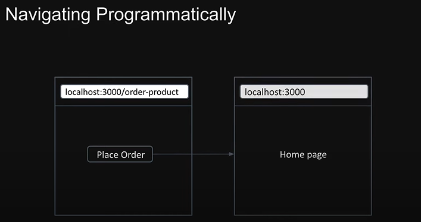
useRouter only works in client component


special file in next.js 
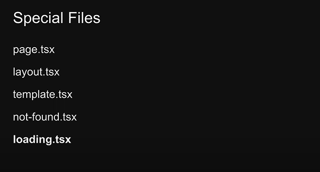
for blog i have implemented loading file 
benefits of loading file 
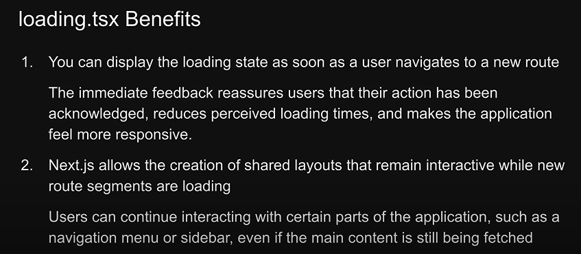


parallel routes
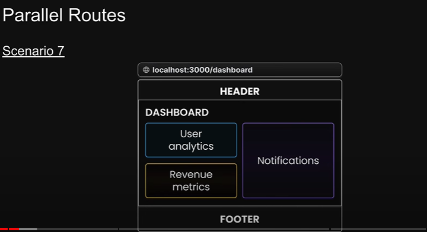
if one section we wan to have loading we caan achieve it if we want to thrown error screen we can achieve it
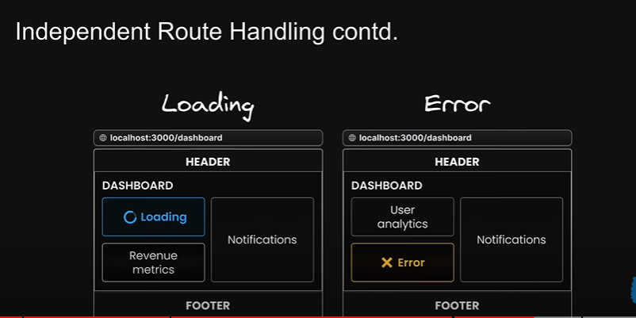

sub navigation 
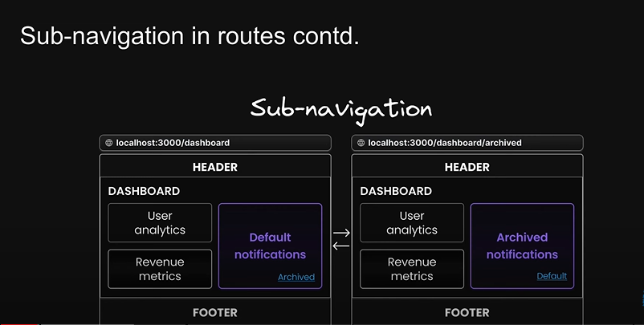

Unmatched routes 
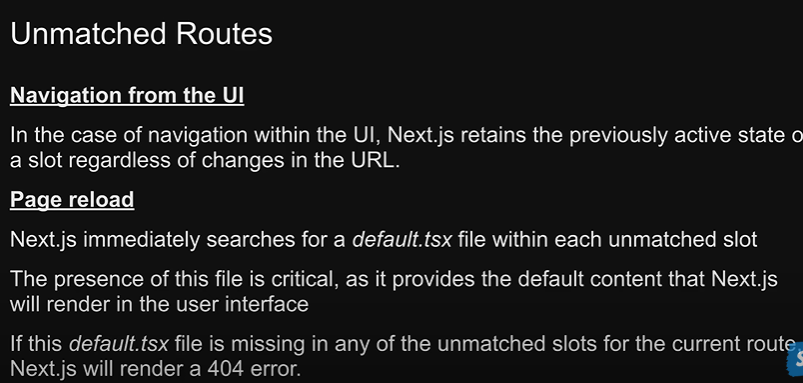
we create default.tsx at the same level as page.tsx if dont we 404 error 
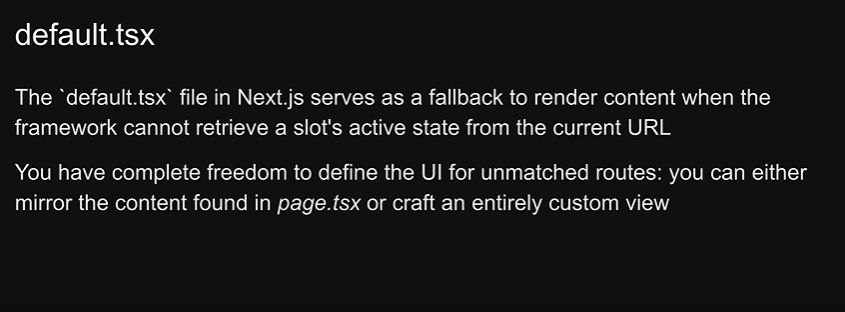

conditional routes 